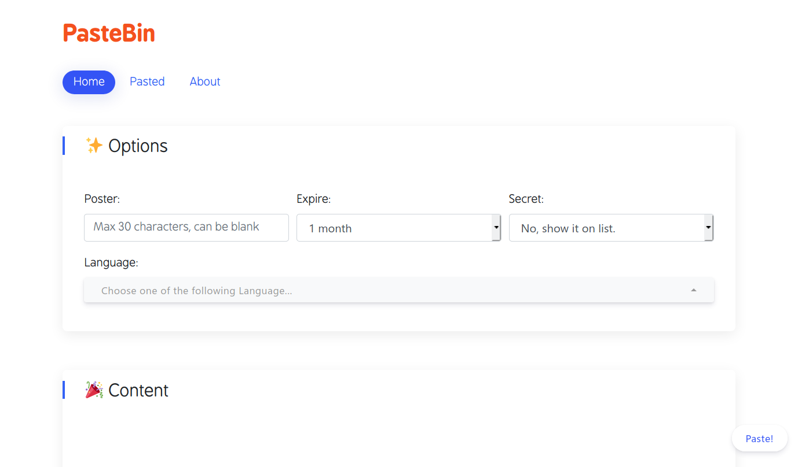

# PasteBin

一个用 Flask 后端和一些前端技术创造的代码剪切板。

Demo https://icpc.cczu.edu.cn/paste



## Features

### Markdown 渲染

当粘贴的是 Markdown 格式时，自动渲染页面。

### 代码格式自动识别

你可以留空代码格式选项，它会尝试自动识别（不一定准）。——Powered by highlight.js

### 所有文件

公开的片段可以在 http://pastebinpath/all 上看到。

### Easy data transmission ui

可以直接把原始代码 Post 到 http://pastebinpath/raw, 或者 Post 一个更详细的 JSON 到 http://pastebinpath/paste. 更多信息请移步 [DataExchange.md](doc/DataExchange.md).

## 运行

### 用 Docker 跑

```sh
sudo docker run --restart=always --name pastebin -p 127.0.0.1:80:80 -v /var/pastebin:/pastebin/data weicheng97/pastebin:3.0
```

### 直接跑

```sh
./run.sh
```

### 调试

```sh
./run.py
```

### 反向代理

如果要用别的地址访问，例如 https://example.com/paste, 需要在 data 文件夹里新建一个 `settings.json` 文件, 并放入以下内容:

```
{
    "baseurl": "https://example.com/paste"
}
```
